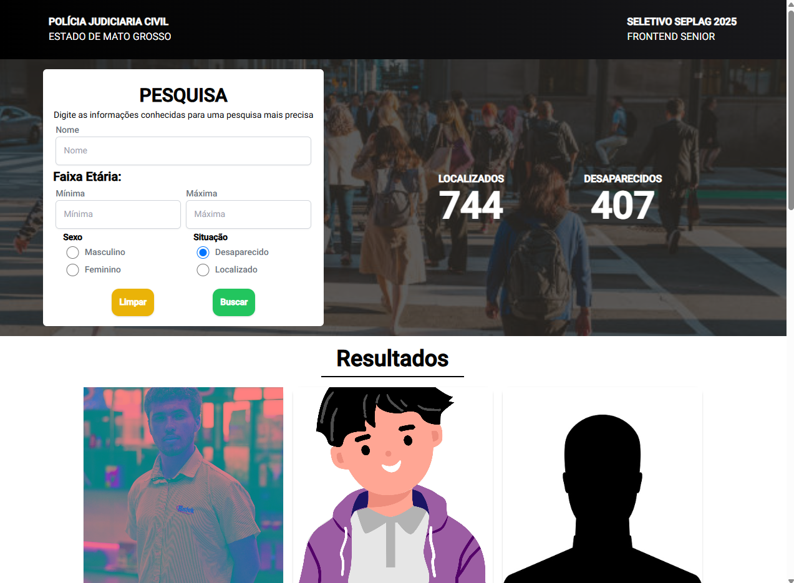
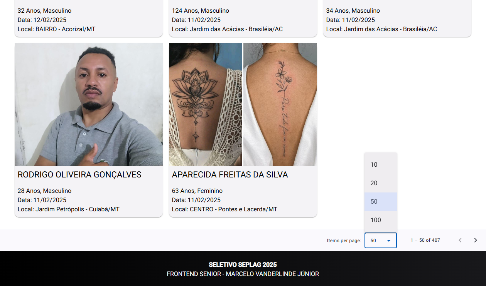
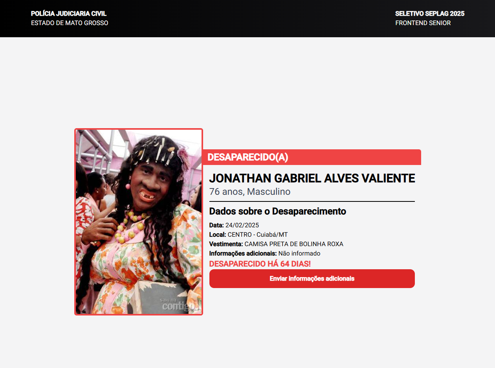
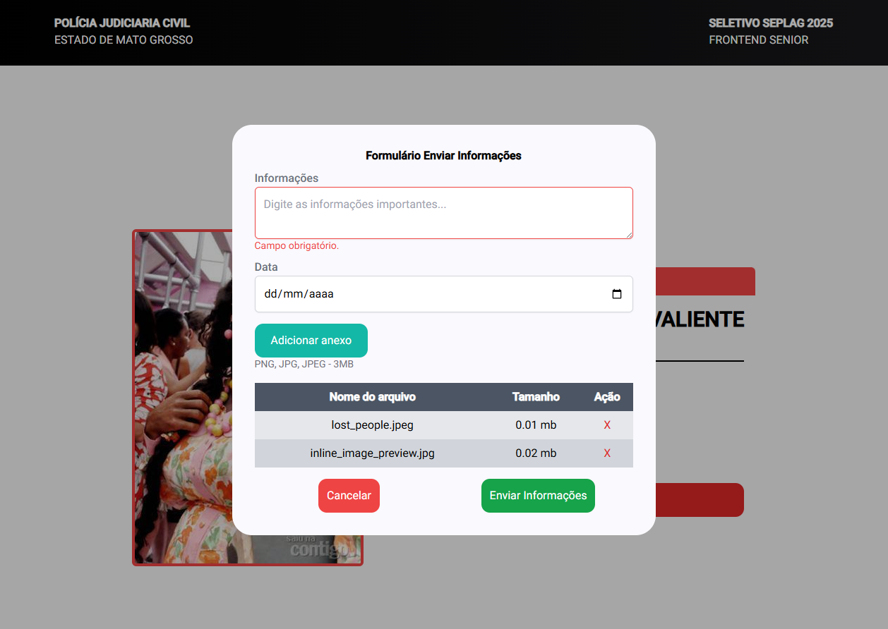
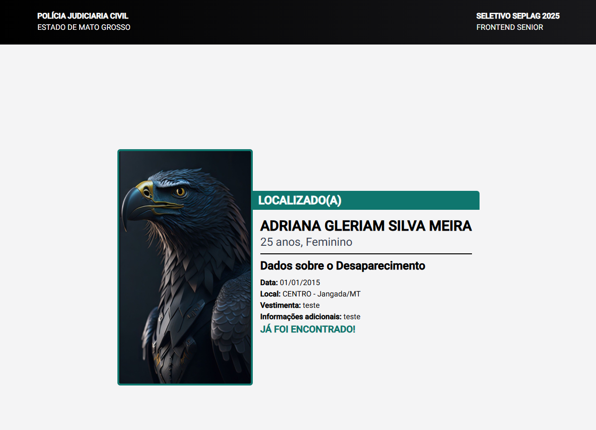
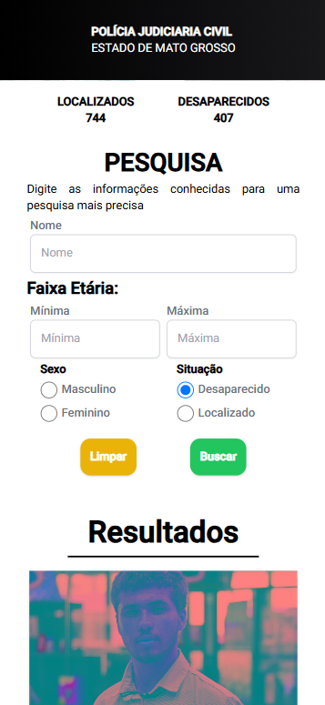
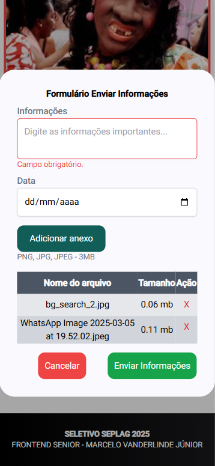
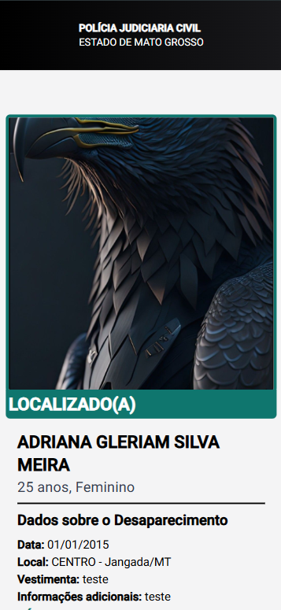

## PROCESSO SELETIVO SEPLAG 2025

- [Dados do Participante](#dados-do-participante)
- [Informações do Projeto](#informações-do-projeto)
- [Executando a Aplicação](#executando-a-aplicação)
  - [Com Node.js](#com-nodejs)
  - [Com Docker-Compose](#com-docker-compose)
  - [Com Docker sem Docker Compose](#com-docker-sem-docker-compose)
- [Imagens do Projeto](#imagens-do-projeto-rodando)

### VAGA: FRONTEND SENIOR

### DADOS DO PARTICIPANTE:

Nome: Marcelo Vanderlinde Júnior  
Telefone: (66) 9 9952-3868
Email: mvanderlindejr@gmail.com  
Vaga: Frontend Senior

### Informações do Projeto

Frameworks e libs utilizadas:

- Angular v19
- Angular Material v19
- Tailwind v3.4.17

## Executando a Aplicação

### Com Node.js

- Tenha instalado o Node na versão `18.19` ou superior;
- Rode os seguintes comandos:

```bash
#Para instalar as dependências do projeto.
npm install
```

```bash
#Para iniciar o projeto em modo Desenvolvimento.
npm run start
```
Esse procedimento irá realizar o build e vai iniciar e abrir no navegador padrão. Se precisar do link para o acesso em outro navegador utilize: [localhost:4200](http://localhost:4200)

### Com Docker Compose

#### Requisitos:

- Docker
- Docker Compose

#### Passos

- Na raiz do projeto, rode o comando

```bash
docker compose up --build -d
```

Esse procedimento irá realizar o build no projeto e executar em um container, para acessar é só utilizar a url: [localhost:8780](http://localhost:8780)


### Com Docker (Sem docker compose)

#### Requisitos:

- Docker

Em um terminal, rode o seguinte comando:

```bash
docker run -d -t -p 8780:80 vanderlindejr/seplag-frontend-2025
```

Isto irá executar em um container, para acessar é só utilizar a url: [localhost:8780](http://localhost:8780)

# Imagens do projeto rodando

## Desktop











## Mobile (Responsivo)






